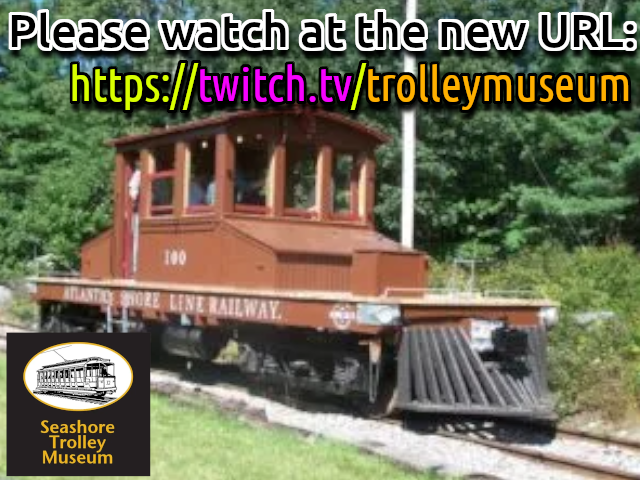

RTSP Streaming server advertising the change of the Live Stream URL



## Build

```bash
docker build -t livecamurlchanged .
```

## Run

```bash
docker run -d --name=livecamurlchanged -p 8554:8554 livecamurlchanged 
```

### Entering the Container

The container is built on Alpine Linux and includes Bash.

```bash
docker ps
docker exec -ti $CONTAINER_ID /bin/bash
```

### Retrieving Logs

The logs are streamed to `stdout`

```bash
docker ps
docker logs $CONTAINER_ID
```


